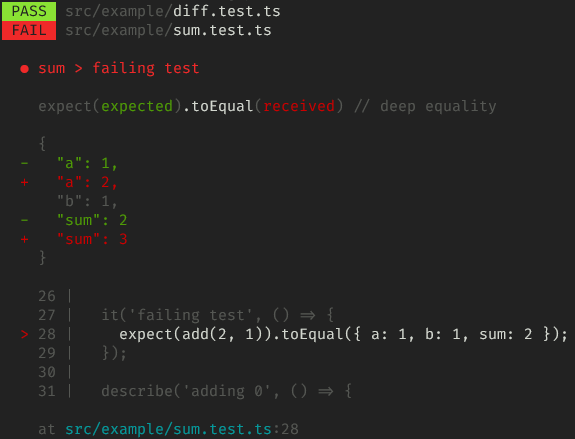
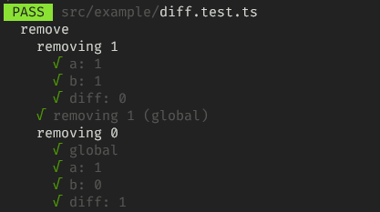
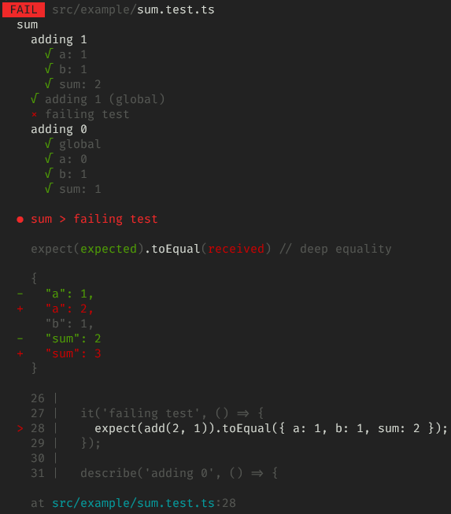
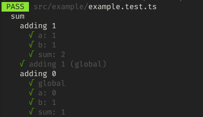
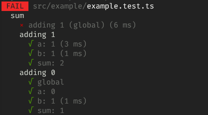

# Global idea
Check is a **personal** project for now.
It is very raw and undocumented at this stage.

It's an exploration at writing a test framework that addresses some of `jest`'s shortcomings (imho):
- the automatic hoisting of imports and mocks
  - this makes it diffucult to write you own helpers on top of `jest`
- the need to use `beforeEach` / `afterEach` ([detailed explanation here](./examples/BEFOREEACH.md))
  - which result in the need to use convoluted syntax when you need to access something inside the `beforeEach`
- missing matchers for React-based use-cases (probably other frameworks as well)
  - when testing a component, it's difficult to test for only _some_ props
- ...

# setup
install dependencies by running
`yarn`

create your `.env` file by copying `.env.sample` [details here](#.env)

# try it out
To try it out, clone the repository, have a look at files in the `src/example` folder: `example.ts` & test files.

You can first run the test using `jest` with `yarn jest` → 3 tests will fail, 1 because it's supposed to, and 2 because of how `jest` execute the tests. ❌

You can then run the test using this new framework with `yarn check` → 1 test will fail (it's supposed to) and all other will pass. ✔

# what's included
- one optional argument: config file path
  - defaults to `check.config.json`
  - if the config file is not present, use the default config
- config accepts:
  - a **glob pattern** (default: `**/*.test.ts`)
- tests are run synchronously (no watch mode yet)
- in test files
  - accepts `describe` and `it` / `test` syntax
  - `toEqual` matcher (uses `lodash`)
  - `not` function
- prints the result in the console (using `chalk`)
  - if only one test file, prints global result (PASS/FAIL), detailed tests tree & errors
  - if multiple test files, prints global result (PASS/FAIL) & errors for each file (no detailed tests tree)

## example of test outputs
| multiple files | single file (PASS) | single file (FAIL) |
|-|-|-|
|  |  |  |

## check / jest comparison example

| check | jest |
|-|-|
|  |  |
| output tests in the written order | reorders tests (strict hierarchical order) |
| all tests pass ✔ | one test fail ❌ |

# how it works (for now)
- the whole thing is written in **Typescript** and runs using `ts-node` (with the currently experimental `@swc` transpiler for performance)
- it works on **Typescript** test files (usually `xxxx.test.ts`)
- each file is handled in its own thread using node's [`worker_thread`](https://nodejs.org/api/worker_threads.html)
- first, the parser (cf. [src/parser](./src/parser)) will:
  - read the file (it must be _utf-8_)
  - transpile it (using **Typescript**) in _CommonJS_ & the _Latest_ configuration from ts
  - get the transpiled file tree (using **Typescript**'s `createSourceFile`)
  - parse it into JSON using the project's own parser (output in `out/****-result.json` if `WRITE_DEBUG_FILES` is set)
- then, the runner will get the parser result and:
  - transform it into _runs_ (output in `out/****-runs.json` if `WRITE_DEBUG_FILES` is set)
    - a hierarchical representation of the test suites
    - with code & tests being grouped in an array at the test level
    - this array contains the whole code & test you pass through to go to that test → they will be executed this way
  - execute those _runs_
    - using the **node vm**
    - using a brand new context for each run to avoid side-effects
    - output a result in the console (cf. images above)

# .env
| name | meaning |
|-|-|
| `WRITE_DEBUG_FILES` | `true` → write debug files (`result.json` & `runs.json`) in the `out` folder |

# TODO
- [x] output details when errors
  - logical _path_ of the error
  - meaningful message, including comparison
  - code line (~~might be tricky because of transpilation~~ will work thx to the use of sourcemaps)
- [ ] test the framework using itself
  - [ ] local
  - [ ] CI
- [ ] other matchers
- [ ] watch (including code files changes with `chokidar`)
- [ ] don't use `jest` types but our own
- [ ] mocks
- [x] deal with multiple files
  - [x] accept a glob / pattern
  - [x] run multiple files in parallel
  - [x] output short version of pass/fail when multiple files
  - [x] output recap of errors if any
- [x] read config instead of cli arguments
- [x] expose commands to be used from the outside: `check example`
- [ ] write recap at the end (nb test suites, nb tests, time, etc.)
- [ ] publish a package
- [ ] deal with React specificities: props, etc.
- [ ] dev experience: can interactively set pattern, etc.
- [x] only write debug json files when env var set
