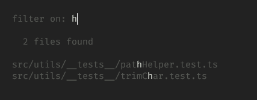
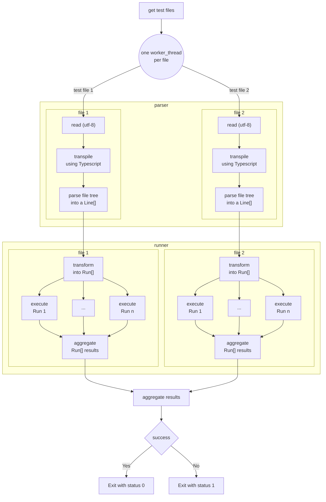

[](https://github.com/e-krebs/check/actions/workflows/ci.yml)

# Global idea
Check is a **personal** project for now.
It is very raw and undocumented at this stage.

It's an exploration at writing a test framework that addresses some of `jest`'s shortcomings (imho):
- when multiple tests fail in a block, you only see the first one
- the automatic hoisting of imports and mocks
  - this makes it difficult to write you own helpers on top of `jest`
- the need to use `beforeEach` / `afterEach` ([detailed explanation here](./examples/BEFOREEACH.md))
  - which result in the need to use convoluted syntax when you need to access something inside the `beforeEach`
- missing matchers for React-based use-cases (probably other frameworks as well)
  - when testing a component, it's difficult to test for only _some_ props
- ...

# setup
install dependencies by running
`yarn`

create your `.env` file by copying `.env.sample` [details here](#.env)

# try it out
To try it out, clone the repository, have a look at files in the `src/example` folder: `example.ts` & test files.

You can first run the test using `jest` with `yarn jest` → 3 tests will fail, 1 because it's supposed to, and 2 because of how `jest` execute the tests. ❌

You can then run the test using this new framework with `yarn check` → 1 test will fail (it's supposed to) and all other will pass. ✔

# what's included
## CLI (all arguments are optional)

| argument | default value | meaning |
|-|-|-|
| _configuration file path_ | `check.config.json` | cf. below |
| `--watch` | false | will watch for file changes to re-trigger tests |

## Configuration file (optional)

| parameter | default value | meaning |
|-|-|-|
| `testFilesPattern` | `**/*.test.ts` | the pattern to get the test files to run |
| `watchFilesPattern` | `**/*` | _(watch mode only)_ the pattern to get the files to watch |
| `watchFilesIgnored` | `['node_modules', '.git', '.swc', 'dist', 'out']` | _(watch mode only)_ files or folder not to watch |

## Watch mode
In watch mode, tests are re-run every time you save a file.

> - If only one test file is run, you'll see this file full test tree (and individual status) in your terminal
> - If more than one test file is run, you'll see only the global status for each test file
> - In both cases, you'll see details for failing tests _(see examples below)_

You also have access to additional functionalities as described in your terminal:
```sh
Ran all tests.

press <f> to filter
press <ctrl> + <c> to exit
```
- pressing <kbd>ctrl</kbd> + <kbd>c</kbd> will stop the watch mode and exit
- pressing <kbd>f</kbd> will allow you to enter a **filter** on which tests to run. You'll see a live list of files affected by your filter.

  - once you press <kbd>enter</kbd>, only those tests will be run (still on watch mode)
  - you can later press <kbd>f</kbd> again to change that filter (entering nothing runs all tests)

## Test files & running them
### general
- in test files
  - accepts `describe` and `it` / `test` syntax
  - **standard matcher** are available:
    - `toEqual` matcher (uses `lodash`)
    - `not` function
  - accepts `spy` definition & exposes related **spy matchers** (cf. section below)
- prints the result in the console (using `chalk`)
  - if only one test file, prints global result (PASS/FAIL), detailed tests tree & errors
  - if multiple test files, prints global result (PASS/FAIL) & errors for each file (no detailed tests tree)
  - in both cases, in case of errors, `check` continues to run tests and show all tests that are failing, not just the first one

### spy
you can defined a spy by specifying the module & declaration you want to spy:
```ts
const spyExistsSync = spy('fs', 'existsSync')
```
optionally, you can add typing to your spy function:
```ts
import { type existsSync } from 'fs';

const spyExistsSync = spy<typeof existsSync>('fs', 'existsSync');
```

Regular matchers don't work on spy function, instead, they have their dedicated set of spy matchers. So far:
- `toBeCalledTimes` matcher (will compare the number in parameter with the spy function inner counter)

> A note about typings:
>
> `check`'s types are smart enough so that depending on the parameter passed to the `it`/`test` function:
>  - if this parameter is a spy functions, only spy matchers are available (not standard matchers)
>  - if this parameter is not a spy function, only standard matchers are available (not spy matchers)

## example of test outputs
| multiple files | single file (PASS) | single file (FAIL) |
|-|-|-|
|  |  |  |

## check / jest comparison example

| check | jest |
|-|-|
|  |  |
| output tests in the written order | reorders tests (strict hierarchical order) |
| all tests pass ✔ | one test fail ❌ |

# how it works (for now)
## description
- the whole thing is written in **Typescript** and runs using `ts-node` (with the currently experimental `@swc` transpiler for performance)
- it works on **Typescript** test files (usually `xxxx.test.ts`)
- each file is handled in its own thread using node's [`worker_thread`](https://nodejs.org/api/worker_threads.html)
- first, the parser (cf. [src/parser](./src/parser)) will:
  - read the file (it must be _utf-8_)
  - transpile it (using **Typescript**) in _CommonJS_ & the _Latest_ configuration from ts
  - get the transpiled file tree (using **Typescript**'s `createSourceFile`)
  - parse it into JSON using the project's own parser (output in `out/****-result.json` if `WRITE_DEBUG_FILES` is set)
- then, the runner will get the parser result and:
  - transform it into _runs_ (output in `out/****-runs.json` if `WRITE_DEBUG_FILES` is set)
    - a hierarchical representation of the test suites
    - with code & tests being grouped in an array at the test level
    - this array contains the whole code & test you pass through to go to that test → they will be executed this way
  - execute those _runs_
    - using the **node vm**
    - using a brand new context for each run to avoid side-effects
    - output a result in the console (cf. images above)

## Diagram
> This diagram describes how tests are running without the watch mode.
>
> TBD: describe how watch mode works internally



# .env
| name | meaning |
|-|-|
| `WRITE_DEBUG_FILES` | `true` → write debug files (`result.json` & `runs.json`) in the `out` folder |

# TODO
- [x] output details when errors
  - logical _path_ of the error
  - meaningful message, including comparison
  - code line (~~might be tricky because of transpilation~~ will work thx to the use of sourcemaps)
- [ ] test the framework using itself
- [ ] other matchers
- [x] watch (including code files changes with `chokidar`)
  - [x] watch & cancel running tests if necessary
  - [x] allow to configure watched files pattern & ignored files
- [x] on watch mode, allow to input a custom Regex (and see result live)
- [ ] on watch mode, cache the runs extracted from the test files (based on file hash?)
- [x] don't use `jest` types but our own
  - [x] expect.toEqual should be generic in order to support type completion inside toEqual
- [ ] mock & spy
  - [ ] spy
  - [ ] mock
- [x] deal with multiple files
  - [x] accept a glob / pattern
  - [x] run multiple files in parallel
  - [x] output short version of pass/fail when multiple files
  - [x] output recap of errors if any
- [x] read config instead of cli arguments
- [x] expose commands to be used from the outside: `check example`
- [ ] write recap at the end (nb test suites, nb tests, time, etc.)
- [ ] publish a package
- [ ] deal with React specificities: props, etc.
- [x] dev experience: can interactively set pattern, etc.
- [x] only write debug json files when env var set
