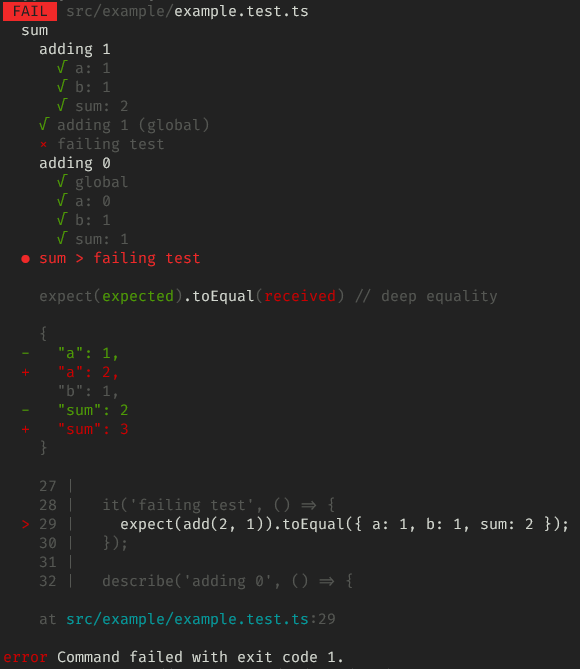

# Global idea
Check is a **personal** project for now.
It is very raw and undocumented at this stage.

It's an exploration at writing a test framework that addresses some of `jest`'s shortcomings (imho):
- the automatic hoisting of imports and mocks
  - this makes it diffucult to write you own helpers on top of `jest`
- the need to use `beforeEach` / `afterEach` ([detailed explanation here](./examples/BEFOREEACH.md))
  - which result in the need to use convoluted syntax when you need to access something inside the `beforeEach`
- missing matchers for React-based use-cases (probably other frameworks as well)
  - when testing a component, it's difficult to test for only _some_ props
- ...

# try it out
To try it out, clone the repository, have a look at files in the `src/example` folder: `example.ts` & `exemple.test.ts`

You can first run the test using `jest` with `yarn jest` → one test will fail because of how `jest` execute the tests. ❌

You can then run the test using this new framework with `yarn check` → all test will pass. ✔

# what's included
- accepts only one file **path** as an input
- in that test file
  - accepts `describe` and `it` / `test` syntax
  - `toEqual` matcher (uses `lodash`)
  - `not` function
- prints the result in the console (using `chalk`)

## example of failing test

## check / jest comparison example

| check | jest |
|-|-|
|  |  |
| output tests in the written order | reorders tests (strict hierarchical order) |
| all tests pass ✔ | one test fail ❌ |

# how it works (for now)
- the whole thing is written in **Typescript** and runs using `ts-node` (with the currently experimental `@swc` transpiler for performance)
- it works on a **Typescript** test file
- first, the parser (cf. [src/parser](./src/parser)) will:
  - read the file (it must be _utf-8_)
  - transpile it (using **Typescript**) in _CommonJS_ & the _Latest_ configuratino from ts
  - get the transpiled file tree (using **Typescript**'s `createSourceFile`)
  - parse it into JSON using the project's own parser (output in `out/result.json`)
- then, the runner will get the parser result and:
  - transform it into _runs_ (output in `out/runs.json`)
    - a hierarchical representation of the test suites
    - with code & tests being grouped in an array at the test level
    - this array contains the whole code & test you pass through to go to that test → they will be executed this way
  - execute those _runs_
    - using the **node vm**
    - using a brand new context for each run to avoid side-effects
    - output a result in the console (cf. image above)

# TODO
- [x] output details when errors
  - logical _path_ of the error
  - meaningful message, including comparison
  - code line (~~might be tricky because of transpilation~~ will work thx to the use of sourcemaps)
- [ ] test the framework using itself
  - [ ] CI
- [ ] other matchers
- [ ] watch (including code files changes with `chokidar`)
- [ ] don't use `jest` types but our own
- [ ] mocks
- [ ] deal with multiple files
  - [ ] accept a glob / pattern
  - [ ] run multiple files in parallel
  - [ ] output short version of success/errors when multiple files
- [ ] expose commands to be used from the outside: `check example`
- [ ] write recap at the end (nb test suites, nb tests, time, etc.)
- [ ] publish a package
- [ ] deal with React specificities: props, etc.
